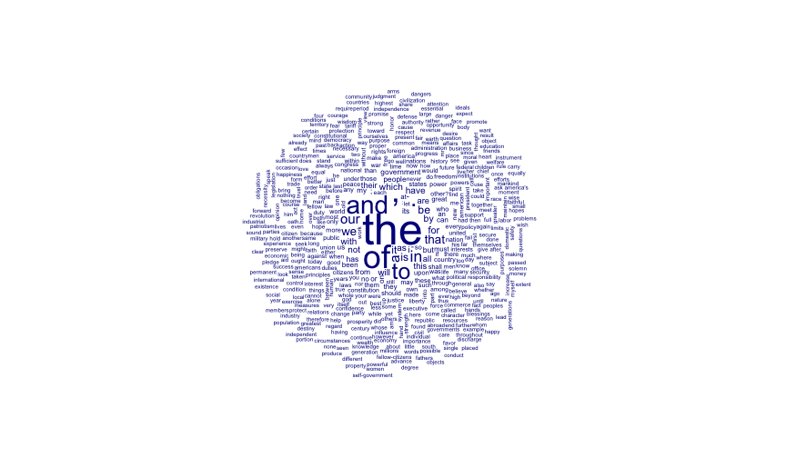

## Can we do better than this?


```r
library(quanteda)
#> Loading required package: methods
#> Package version: 1.2.0
#> Parallel computing: 2 of 4 threads used.
#> See https://quanteda.io for tutorials and examples.
#> 
#> Attaching package: 'quanteda'
#> The following object is masked from 'package:utils':
#> 
#>     View
data <- data_corpus_inaugural
x <- dfm(data)
textplot_wordcloud(x)
```


