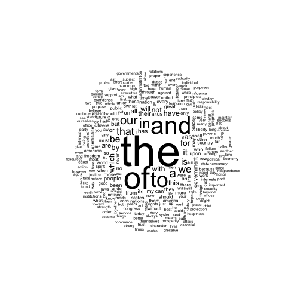

```r
## devtools::install_github("kbenoit/sophistication")
## devtools::install_github("patperry/r-frame")
library(corpus)
library(frame)
library(magrittr)
library(wordcloud)
#> Loading required package: methods
#> Loading required package: RColorBrewer
options(format.limit = 30)

corpus <- as_corpus_frame(quanteda::data_corpus_inaugural)
text_filter(corpus)$drop_punct = TRUE
google1grams <- sophistication::data_matrix_google1grams
```


## Vanilla word cloud


```r
stats <- term_stats(corpus)
stats <- as.dataset(stats)
print(stats)
#>    term  count support
#> 1  the   10082      58
#> 2  of     7103      58
#> 3  and    5310      58
#> 4  to     4526      58
#> 5  in     2785      58
#> 6  that   1789      58
#> 7  be     1481      58
#> 8  it     1389      58
#> 9  for    1197      58
#> 10 by     1083      58
#> 11 have   1011      58
#> 12 this    835      58
#> 13 all     819      58
#> 14 are     814      58
#> 15 has     622      58
#> 16 a      2246      57
#> 17 our    2181      57
#> 18 we     1739      57
#> 19 is     1462      57
#> 20 with    958      57
#> 21 not     957      57
#> 22 as      947      57
#> 23 i       838      57
#> 24 but     654      57
#> 25 from    572      57
#> 26 an      390      57
#> 27 so      388      57
#> 28 which  1006      56
#> 29 will    911      56
#> 30 their   753      56
#> ⋮    (9343 rows total)
```


```r
with(stats[1:300,],
     wordcloud(term, count, random.order = FALSE, scale = c(6, .5)))
```



## No stop words


```r
print(subset(stats, !term %in% stopwords_en))
#>    term       count support
#> 1  people       575      56
#> 2  us           478      55
#> 3  can          471      55
#> 4  great        340      55
#> 5  may          338      53
#> 6  country      304      53
#> 7  nation       293      53
#> 8  time         216      53
#> 9  government   564      52
#> 10 world        311      52
#> 11 now          224      52
#> 12 must         366      51
#> 13 every        298      51
#> 14 nations      199      51
#> 15 shall        314      50
#> 16 citizens     208      50
#> 17 new          247      49
#> 18 free         183      49
#> 19 good         145      49
#> 20 just         123      49
#> 21 one          252      48
#> 22 life         137      48
#> 23 upon         371      47
#> 24 power        236      47
#> 25 united       202      47
#> 26 men          140      47
#> 27 rights       138      47
#> 28 future        94      47
#> 29 states       333      46
#> 30 peace        254      46
#> ⋮         (9207 rows total)

with(subset(stats, !term %in% stopwords_en),
     suppressWarnings(wordcloud(term, count, random.order = FALSE)))
```


## Relative to Google 1-grams


```r
x <- rowSums(google1grams)
i <- match(stats$term, names(x))
stats$google <- x[i]
stats$ratio  <- with(stats, count / google)
print(stats)
#>    term  count support      google        ratio
#> 1  the   10082      58 47229595404 2.134678e-07
#> 2  of     7103      58 30583877751 2.322465e-07
#> 3  and    5310      58 21967428644 2.417215e-07
#> 4  to     4526      58 18921974620 2.391928e-07
#> 5  in     2785      58 15180655265 1.834572e-07
#> 6  that   1789      58  7710003808 2.320362e-07
#> 7  be     1481      58  4765600159 3.107688e-07
#> 8  it     1389      58  4389244745 3.164554e-07
#> 9  for    1197      58  6028354614 1.985616e-07
#> 10 by     1083      58  4482090719 2.416283e-07
#> 11 have   1011      58  2735579640 3.695743e-07
#> 12 this    835      58  2833482645 2.946904e-07
#> 13 all     819      58  1851969458 4.422319e-07
#> 14 are     814      58  3643287867 2.234246e-07
#> 15 has     622      58  1617279945 3.845964e-07
#> 16 a      2246      57          NA           NA
#> 17 our    2181      57   791200906 2.756569e-06
#> 18 we     1739      57  1545865753 1.124936e-06
#> 19 is     1462      57  8257152905 1.770586e-07
#> 20 with    958      57  4992239290 1.918979e-07
#> 21 not     957      57  4402202193 2.173912e-07
#> 22 as      947      57  5234581099 1.809123e-07
#> 23 i       838      57   136947084 6.119152e-06
#> 24 but     654      57  2090848491 3.127917e-07
#> 25 from    572      57  3291978530 1.737557e-07
#> 26 an      390      57  2525437349 1.544287e-07
#> 27 so      388      57  1275520098 3.041896e-07
#> 28 which  1006      56  3097452143 3.247831e-07
#> 29 will    911      56  1442386356 6.315922e-07
#> 30 their   753      56  2060194528 3.654995e-07
#> ⋮                             (9343 rows total)
```

Order by ratio


```r
reorder(stats, desc = ratio)
#>    term        count support google       ratio
#> 1  stennis         1       1     21 0.047619048
#> 2  belleau         1       1     48 0.020833333
#> 3  argonne         2       2    100 0.020000000
#> 4  guadalcanal     1       1     68 0.014705882
#> 5  bernardin       1       1     82 0.012195122
#> 6  goethals        1       1     87 0.011494253
#> 7  salerno         1       1    214 0.004672897
#> 8  mondale         1       1    218 0.004587156
#> 9  micah           3       1    675 0.004444444
#> 10 dingley         2       1    482 0.004149378
#> 11 dirksen         1       1    254 0.003937008
#> 12 dakotas         1       1    266 0.003759398
#> 13 macleish        1       1    281 0.003558719
#> 14 yorktown        2       2    604 0.003311258
#> 15 obama           3       1   1223 0.002452984
#> 16 arlington       2       2    818 0.002444988
#> 17 americans      74      21  30334 0.002439507
#> 18 america       184      30  91568 0.002009436
#> 19 gettysburg      2       2   1034 0.001934236
#> 20 cubans          1       1    548 0.001824818
#> 21 scandinavia     1       1    644 0.001552795
#> 22 philippines     6       2   3991 0.001503383
#> 23 hatfield        1       1    669 0.001494768
#> 24 gillis          1       1    677 0.001477105
#> 25 biden           1       1    700 0.001428571
#> 26 monticello      1       1    700 0.001428571
#> 27 delano          1       1    723 0.001383126
#> 28 sumter          1       1    754 0.001326260
#> 29 archibald       1       1    791 0.001264223
#> 30 quayle          1       1    826 0.001210654
#> ⋮                             (9343 rows total)
```

Threshold count


```r
(subset(stats, count >= 5)
 %>% reorder(desc = ratio))
#>    term        count support   google        ratio
#> 1  americans      74      21    30334 2.439507e-03
#> 2  america       184      30    91568 2.009436e-03
#> 3  philippines     6       2     3991 1.503383e-03
#> 4  mississippi     7       5     8853 7.906924e-04
#> 5  american      163      45   213155 7.647017e-04
#> 6  cannot         56      22    82627 6.777446e-04
#> 7  washington     23      16    35844 6.416695e-04
#> 8  columbia        5       3    11155 4.482295e-04
#> 9  jefferson      10       6    24857 4.023012e-04
#> 10 europe         19      11    56175 3.382287e-04
#> 11 spain           6       2    20139 2.979294e-04
#> 12 texas          11       2    38801 2.834978e-04
#> 13 cuba            5       1    18029 2.773310e-04
#> 14 european       14       7    91362 1.532366e-04
#> 15 atlantic        7       6    47497 1.473777e-04
#> 16 british        10       5    97272 1.028045e-04
#> 17 asia            5       5    51792 9.654001e-05
#> 18 mr             31      12   663655 4.671102e-05
#> 19 indian          8       6   201301 3.974148e-05
#> 20 federative      5       3   138013 3.622847e-05
#> 21 almighty       29      25   904324 3.206815e-05
#> 22 guaranties      5       4   211965 2.358880e-05
#> 23 congress      130      29  5807525 2.238475e-05
#> 24 confederacy    19       8  1406543 1.350830e-05
#> 25 guaranty       11      10   873641 1.259098e-05
#> 26 pacific        13       9  1184827 1.097207e-05
#> 27 amity           9       6   896612 1.003779e-05
#> 28 hatreds         5       4   510608 9.792248e-06
#> 29 united        202      47 21223302 9.517840e-06
#> 30 forbearance    14       9  1582693 8.845683e-06
#> ⋮                                (2705 rows total)
```

## Another wordcloud


```r
top <- (subset(stats, count >= 5)
        %>% reorder(desc = ratio))[1:300, ]
with(top, wordcloud(term, ratio, random.order = FALSE,
                    scale = c(10, .5)))
```


